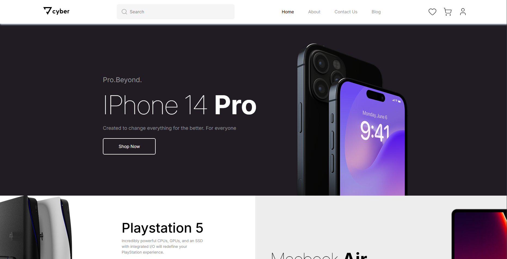

# 🛒 Cybertech Store — Projeto Fullstack (Portfólio)



> Projeto de e-commerce fullstack desenvolvido como parte do meu portfólio pessoal.
>
> 🚧 Projeto em desenvolvimento.

---

## 📸 Preview

A imagem acima representa o estado atual da aplicação, com destaque para:
- Header com navegação, busca e ações do usuário
- Banner principal promocional
- Seções do banner organizadas em grid
- Layout moderno e responsivo utilizando template gratuito disponível no [Figma](https://www.figma.com/design/5ShWzeXmTChbGMLHAcSocJ/E-Store---Mobile-web--Community-?node-id=91-75&t=ZcVUk93YZsdnbVhy-0)

---

## 👩‍💻 Sobre o projeto

O **Cyber Store** é um projeto de e-commerce criado para simular um ambiente real de produto digital, aplicando conceitos utilizados no mercado.

O objetivo principal é demonstrar:
- Organização de código
- Componentização em React
- Uso de CSS Grid e Tailwind CSS
- Integração entre front-end e back-end (em andamento)
- Boas práticas de UI/UX

Este projeto faz parte do meu **portfólio profissional**.

---

## 🚀 Funcionalidades

### Implementadas
- [x] Layout responsivo
- [x] Header com navegação e busca
- [x] Banner principal
- [x] Grid de produtos
- [x] Componentes reutilizáveis

### Em desenvolvimento
- [ ] Página de detalhes do produto
- [ ] Carrinho de compras
- [ ] Autenticação de usuário
- [ ] Favoritos (wishlist)
- [ ] Integração completa com API

---

## 🛠️ Tecnologias utilizadas

### Front-end
- React
- TypeScript
- Tailwind CSS
- Lucide Icons
- Vite

### Back-end (planejado)
- Node.js
---

## 📁 Estrutura do projeto (em desenvolvimento)

```bash
src/
├── assets/
├── components/
│   ├── banner/
│   ├── footer/
│   ├── header/
│   ├── icon-button/
│   └── layout/
├── contexts/
├── pages/
│   ├── cart/
│   └── home/
├── App.tsx
├── index.css
└── main.tsx
```

## 🌐 Acesso 

<a>Em breve...</a>

## Autor

<a>
<br />
<sub><b>Andressa Martins</b></sub></a>

Feito por Andressa Martins. Entre em contato <3.

<a href="mailto:andressa.devsystem@gmail.com"></a>

